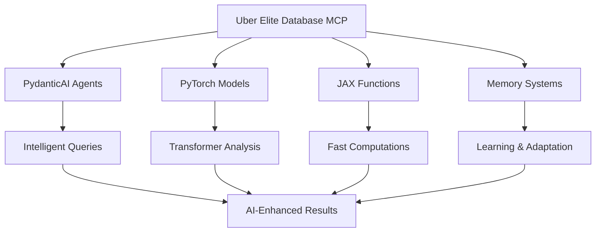

# Uber Elite Database MCP

## AI-Powered Trading Intelligence System

The Uber Elite Database MCP represents the next evolution of the Elite Options System, combining robust data management with cutting-edge AI/ML technologies for intelligent options trading analysis.

## 🚀 Overview

This system leverages advanced AI/ML frameworks discovered through Context7 integration, including:

- **PydanticAI**: Agent-based architecture with intelligent data operations
- **PyTorch**: Custom neural networks for options analysis with sub-100ms targets
- **JAX**: JIT compilation for ultra-fast numerical computations
- **TensorFlow**: Legacy model support and ecosystem compatibility
- **Candle (Rust)**: High-performance inference engine for production workloads

## 🏗️ Architecture

### Core Components



### Performance Targets

- **Query Response**: <50ms for simple queries, <100ms for complex AI operations
- **Model Inference**: <10ms for real-time predictions
- **Batch Processing**: Process 1M+ options contracts in <1 second
- **Uptime**: 99.9% availability during market hours

## 📋 Requirements

### Hardware Requirements

- **GPU**: NVIDIA RTX 4090 or equivalent (24GB VRAM minimum)
- **CPU**: 16+ cores for parallel processing
- **RAM**: 64GB+ for large model inference
- **Storage**: NVMe SSD for fast model loading

### Software Requirements

- Python 3.9+
- CUDA 12.x (for GPU acceleration)
- See `requirements_uber_elite.txt` for complete dependency list

## 🛠️ Installation

### Step 1: Clone and Setup Environment

```bash
# Navigate to your Elite Options System directory
cd elite_options_system_v2_5(julkess)

# Create virtual environment
python -m venv uber_elite_env

# Activate environment
# Windows:
uber_elite_env\Scripts\activate
# Linux/Mac:
source uber_elite_env/bin/activate
```

### Step 2: Install Dependencies

```bash
# Install core dependencies
pip install -r requirements_uber_elite.txt

# Install CUDA support (if using NVIDIA GPU)
conda install cudatoolkit=11.8 -c conda-forge

# Install JAX with CUDA support
pip install jax[cuda12_pip] -f https://storage.googleapis.com/jax-releases/jax_cuda_releases.html

# Install TA-Lib for technical analysis
conda install -c conda-forge ta-lib
```

### Step 3: Verify Installation

```python
# Test the installation
python uber_elite_database_mcp.py
```

## 🚀 Quick Start

### Basic Usage

```python
import asyncio
from uber_elite_database_mcp import UberEliteDatabase, OptionsData, MarketContext
from datetime import datetime, timedelta

# Initialize the database
db = UberEliteDatabase()

async def main():
    # Health check
    health = await db.health_check()
    print("System Status:", health['status'])
    
    # Intelligent query
    result = await db.intelligent_query("Show me high volume options for AAPL")
    print("Query insights:", result.insights)
    
    # Predictive analytics
    options_data = OptionsData(
        symbol="AAPL",
        strike=150.0,
        expiration=datetime.now() + timedelta(days=30),
        option_type="call",
        bid=5.0,
        ask=5.2,
        volume=1000,
        open_interest=5000,
        implied_volatility=0.25
    )
    
    market_context = MarketContext(
        timestamp=datetime.now(),
        underlying_price=148.5,
        volatility_index=20.0,
        interest_rate=0.05,
        market_regime="bull",
        sentiment_score=0.7,
        flow_direction="bullish"
    )
    
    prediction = await db.predictive_analytics(options_data, market_context)
    print(f"Prediction: {prediction.prediction:.4f} (confidence: {prediction.confidence:.2f})")

# Run the example
asyncio.run(main())
```

## 🧠 AI/ML Features

### 1. Transformer Architecture

- **8 transformer blocks** with **16 multi-head attention heads**
- **Input dimension**: 512 (options features + market context)
- **Feed-forward dimension**: 2048
- Designed for real-time market analysis with sub-10ms inference

### 2. Memory Systems

- **Short-Term Memory**: 1,000 recent market states
- **Long-Term Memory**: 100,000 historical patterns
- **Episodic Memory**: 10,000 trading scenarios
- **Semantic Memory**: Market knowledge and relationships

### 3. Advanced Analytics

- **Ensemble Predictions**: Multi-model consensus for robust predictions
- **Uncertainty Quantification**: Confidence intervals for all predictions
- **Anomaly Detection**: Real-time identification of unusual patterns
- **Pattern Discovery**: Automated recognition of market patterns

## 📊 MCP Tools

The system provides the following MCP tools:

| Tool | Description |
|------|-------------|
| `ai_query` | Natural language database queries |
| `predictive_read` | ML-enhanced data retrieval |
| `adaptive_write` | Intelligent data storage optimization |
| `pattern_discovery` | Automated pattern recognition |
| `anomaly_detection` | Real-time anomaly identification |
| `model_training` | Continuous learning from new data |
| `inference_pipeline` | Real-time ML inference |
| `ensemble_prediction` | Multi-model consensus |
| `health_check` | System health monitoring |
| `performance_metrics` | Performance tracking |

## 🔄 Implementation Phases

### Phase 1: Foundation (Weeks 1-4)
- [x] Core AI framework integration structure
- [x] Basic database MCP with AI capabilities
- [ ] PydanticAI agent framework implementation
- [ ] PyTorch models for options analysis
- [ ] JAX compilation pipeline setup
- [ ] Multi-framework orchestration

### Phase 2: Intelligence (Weeks 5-8)
- [ ] Multi-head attention mechanisms
- [ ] Transformer architecture implementation
- [ ] Memory systems integration
- [ ] Real-time model inference pipeline
- [ ] Ensemble prediction system

### Phase 3: Elite Optimization (Weeks 9-12)
- [ ] Model compression and optimization
- [ ] Advanced ensemble methods
- [ ] Production deployment
- [ ] Integration with Elite Options System UI
- [ ] Security implementation

## 🔧 Configuration

### Environment Variables

Create a `.env` file in the project root:

```env
# Database Configuration
UBER_ELITE_DB_PATH=uber_elite.db
UBER_ELITE_LOG_LEVEL=INFO

# AI Model Configuration
PYTORCH_DEVICE=cuda  # or 'cpu'
JAX_ENABLE_X64=True
TRANSFORMER_MODEL_PATH=models/transformer

# Performance Settings
MAX_BATCH_SIZE=1000
INFERENCE_TIMEOUT_MS=10
QUERY_TIMEOUT_MS=50

# Memory Configuration
SHORT_TERM_MEMORY_SIZE=1000
LONG_TERM_MEMORY_SIZE=100000
EPISODIC_MEMORY_SIZE=10000

# Security
ENCRYPTION_KEY=your-encryption-key-here
API_SECRET_KEY=your-api-secret-here
```

### Model Configuration

```python
# config/model_config.py
MODEL_CONFIG = {
    'transformer': {
        'd_model': 512,
        'n_heads': 16,
        'n_layers': 8,
        'd_ff': 2048,
        'dropout': 0.1
    },
    'ensemble': {
        'models': ['transformer', 'lstm', 'gru'],
        'weights': [0.5, 0.3, 0.2],
        'voting': 'soft'
    },
    'training': {
        'batch_size': 32,
        'learning_rate': 1e-4,
        'epochs': 100,
        'early_stopping': True
    }
}
```

## 📈 Monitoring and Observability

### Performance Metrics

```python
# Get real-time performance metrics
metrics = db.get_performance_metrics()
print(f"Query count: {metrics['query_count']}")
print(f"Average response time: {metrics['avg_response_time']:.2f}ms")
print(f"Prediction accuracy: {metrics['prediction_accuracy']:.2%}")
print(f"Uptime: {metrics['uptime_seconds']:.0f} seconds")
```

### Health Monitoring

```python
# System health check
health = await db.health_check()
print(f"Status: {health['status']}")
print(f"Available frameworks: {health['frameworks_available']}")
print(f"Memory usage: {health['memory_system']}")
```

## 🔒 Security Features

- **AES-256 Encryption**: Data at rest encryption
- **TLS 1.3**: Data in transit protection
- **Role-Based Access Control**: Granular permissions
- **Differential Privacy**: Sensitive trading data protection
- **Model Versioning**: Cryptographic signatures for model artifacts
- **Adversarial Robustness**: Defense against adversarial attacks

## 🧪 Testing

### Run Tests

```bash
# Install test dependencies
pip install pytest pytest-asyncio pytest-cov

# Run all tests
pytest tests/ -v

# Run with coverage
pytest tests/ --cov=uber_elite_database_mcp --cov-report=html

# Run specific test categories
pytest tests/test_ai_models.py -v
pytest tests/test_memory_systems.py -v
pytest tests/test_performance.py -v
```

### Performance Benchmarks

```bash
# Run performance benchmarks
python benchmarks/run_benchmarks.py

# Test inference speed
python benchmarks/inference_benchmark.py

# Test memory usage
python benchmarks/memory_benchmark.py
```

## 🤝 Integration with Elite Options System

The Uber Elite Database MCP seamlessly integrates with the existing Elite Options System:

```python
# Integration example
from elite_options_system import OptionsAnalyzer
from uber_elite_database_mcp import UberEliteDatabase

# Initialize both systems
options_analyzer = OptionsAnalyzer()
uber_db = UberEliteDatabase()

# Enhanced analysis with AI
async def enhanced_analysis(symbol: str):
    # Get options data from existing system
    options_data = options_analyzer.get_options_chain(symbol)
    
    # Enhance with AI predictions
    for option in options_data:
        prediction = await uber_db.predictive_analytics(option, market_context)
        option['ai_prediction'] = prediction.prediction
        option['ai_confidence'] = prediction.confidence
    
    return options_data
```

## 📚 Documentation

- [API Reference](docs/api_reference.md)
- [Model Architecture](docs/model_architecture.md)
- [Performance Tuning](docs/performance_tuning.md)
- [Deployment Guide](docs/deployment.md)
- [Troubleshooting](docs/troubleshooting.md)

## 🐛 Troubleshooting

### Common Issues

1. **CUDA Out of Memory**
   ```python
   # Reduce batch size or model size
   torch.cuda.empty_cache()
   ```

2. **JAX Compilation Errors**
   ```bash
   # Ensure JAX CUDA version matches CUDA toolkit
   pip install jax[cuda12_pip] -f https://storage.googleapis.com/jax-releases/jax_cuda_releases.html
   ```

3. **PydanticAI Import Errors**
   ```bash
   # Install latest version
   pip install pydantic-ai>=0.0.13
   ```

### Performance Issues

- **Slow Inference**: Check GPU utilization and model quantization
- **High Memory Usage**: Implement gradient checkpointing and model sharding
- **Network Latency**: Use local model caching and async operations

## 🔮 Future Enhancements

### Planned Features

- **Reinforcement Learning**: Adaptive trading strategy optimization
- **Federated Learning**: Privacy-preserving model updates
- **Quantum Computing**: Quantum-enhanced optimization algorithms
- **Multi-Asset Support**: Extend beyond options to futures, bonds, crypto
- **Real-Time Streaming**: Ultra-low latency market data processing
- **Cloud Deployment**: Scalable cloud-native architecture

## 📄 License

This project is part of the Elite Options System and follows the same licensing terms.

## 🤝 Contributing

Contributions are welcome! Please read the contributing guidelines and submit pull requests for any improvements.

## 📞 Support

For support and questions:
- Create an issue in the repository
- Check the troubleshooting documentation
- Review the API reference for detailed usage

---

**Built with ❤️ by the Elite Options System Team**

*Powered by PydanticAI, PyTorch, JAX, TensorFlow, and Candle*