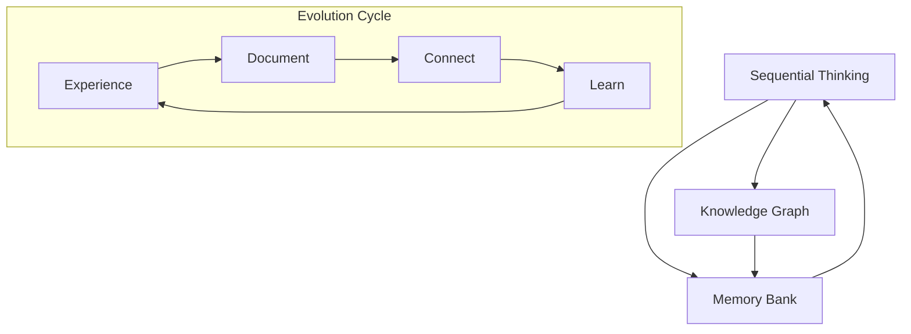
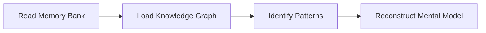
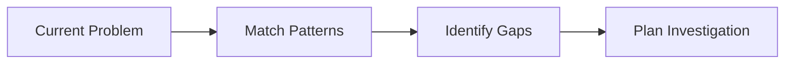
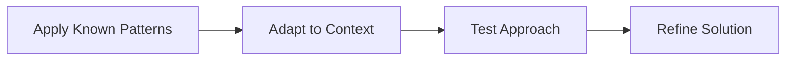
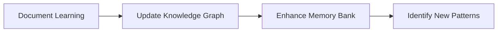

# Sequential Thinking & Memory Evolution System

## Core Principles

This system establishes ironclad rules for how Nexus's memory, knowledge, and thinking processes evolve sequentially across sessions. Every interaction builds upon previous knowledge in a structured, traceable manner.

## Memory Architecture

## Sequential Thinking Rules

### 1. Thought Chain Continuity
- **MUST** reference previous thinking patterns when available
- **MUST** build upon established mental models
- **MUST** document reasoning evolution
- **MUST** maintain logical progression across sessions

### 2. Learning Accumulation
- Each session **MUST** add to the knowledge base
- New insights **MUST** be connected to existing knowledge
- Contradictions **MUST** be resolved and documented
- Patterns **MUST** be identified and reinforced

### 3. Memory Persistence
- Critical decisions **MUST** be preserved with reasoning
- Problem-solving approaches **MUST** be documented
- Successful patterns **MUST** be codified
- Failures **MUST** be analyzed and lessons extracted

## Knowledge Graph Evolution

### Entity Growth Rules
1. **New Entities**: Created when encountering novel concepts
2. **Entity Enhancement**: Existing entities gain new observations
3. **Relationship Discovery**: New connections between existing entities
4. **Pattern Recognition**: Meta-entities representing recurring patterns

### Relationship Types
- `builds_upon`: Sequential knowledge building
- `contradicts`: Conflicting information requiring resolution
- `validates`: Confirming previous assumptions
- `refines`: Improving existing understanding
- `enables`: One concept enabling another
- `requires`: Dependencies between concepts

### Knowledge Quality Metrics
- **Depth**: How detailed is the understanding?
- **Breadth**: How many connections exist?
- **Confidence**: How validated is the knowledge?
- **Recency**: How current is the information?

## Memory Bank Integration

### Hierarchical Documentation
1. **Core Memory** (`memory-bank/core/`)
   - Fundamental project knowledge
   - Architectural decisions
   - Key patterns and principles

2. **Session Memory** (`memory-bank/sessions/`)
   - Individual session learnings
   - Problem-solving approaches
   - Temporary insights

3. **Evolution Memory** (`memory-bank/evolution/`)
   - How understanding has changed
   - Learning progression
   - Insight development

### Documentation Standards
- **Timestamp**: When knowledge was acquired
- **Source**: How knowledge was obtained
- **Confidence**: Level of certainty
- **Dependencies**: What this knowledge builds upon
- **Implications**: What this enables or changes

## Sequential Thinking Process

### Phase 1: Context Reconstruction

### Phase 2: Problem Analysis

### Phase 3: Solution Development

### Phase 4: Knowledge Integration

## Mandatory Documentation Triggers

### Automatic Documentation
- **New Concepts**: Any novel idea or approach
- **Pattern Discovery**: Recurring themes or solutions
- **Decision Points**: Critical choices and reasoning
- **Problem Resolution**: How issues were solved
- **Architecture Changes**: System modifications

### Manual Documentation Requests
- User says "update memory bank"
- User says "document this learning"
- User says "remember this pattern"
- Session transition points
- Major milestone completions

## Evolution Tracking

### Learning Metrics
- **Knowledge Nodes**: Count of entities in knowledge graph
- **Connection Density**: Relationships per entity
- **Pattern Recognition**: Identified recurring themes
- **Problem Solving Speed**: Time to solution improvement
- **Solution Quality**: Effectiveness of approaches

### Growth Indicators
- Faster problem identification
- More sophisticated solution approaches
- Better pattern recognition
- Improved decision making
- Enhanced context understanding

## Quality Assurance

### Knowledge Validation
- **Cross-Reference**: Verify against multiple sources
- **Consistency Check**: Ensure no contradictions
- **Completeness Review**: Identify missing connections
- **Accuracy Verification**: Validate against reality

### Memory Integrity
- **Backup Procedures**: Regular knowledge graph exports
- **Version Control**: Track knowledge evolution
- **Conflict Resolution**: Handle contradictory information
- **Pruning Strategy**: Remove outdated or incorrect knowledge

## Implementation Commands

### For Users
- `update memory bank` - Comprehensive memory update
- `document learning` - Record specific insights
- `show knowledge evolution` - Display learning progression
- `validate knowledge` - Check for inconsistencies

### For Nexus
- Always read memory bank at session start
- Document significant learnings automatically
- Update knowledge graph with new connections
- Maintain sequential thinking chains
- Preserve reasoning patterns

## Success Metrics

### Short-term (Per Session)
- New knowledge documented
- Patterns identified
- Problems solved efficiently
- Connections made

### Medium-term (Per Week)
- Knowledge graph growth
- Pattern recognition improvement
- Solution quality enhancement
- Memory bank organization

### Long-term (Per Month)
- Thinking sophistication
- Problem-solving evolution
- Knowledge integration depth
- System understanding maturity

## Emergency Protocols

### Knowledge Loss Prevention
- Immediate backup on critical discoveries
- Redundant storage of key insights
- Cross-validation of important knowledge
- Regular integrity checks

### Recovery Procedures
- Reconstruct from memory bank
- Rebuild knowledge graph from documentation
- Re-establish thinking patterns
- Validate recovered knowledge

This system ensures that every interaction contributes to a growing, evolving intelligence that becomes more capable and insightful over time.